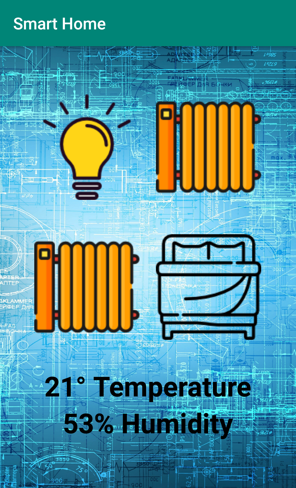

# SmartHome
updated smart home, intregrating MQTT and AWS ec2 projects and learning

Hub is written in python and features temperature sensor and 433mhz radios controling remote sockets, it uses MQTT to communicate with mobile applications running on devices, and runs on a Raspberry Pi

the MQTT broker is located on an ec2 instance on AWS to allow connection from outside the local network
device status data is synced across all devices regardless of connection type

 
